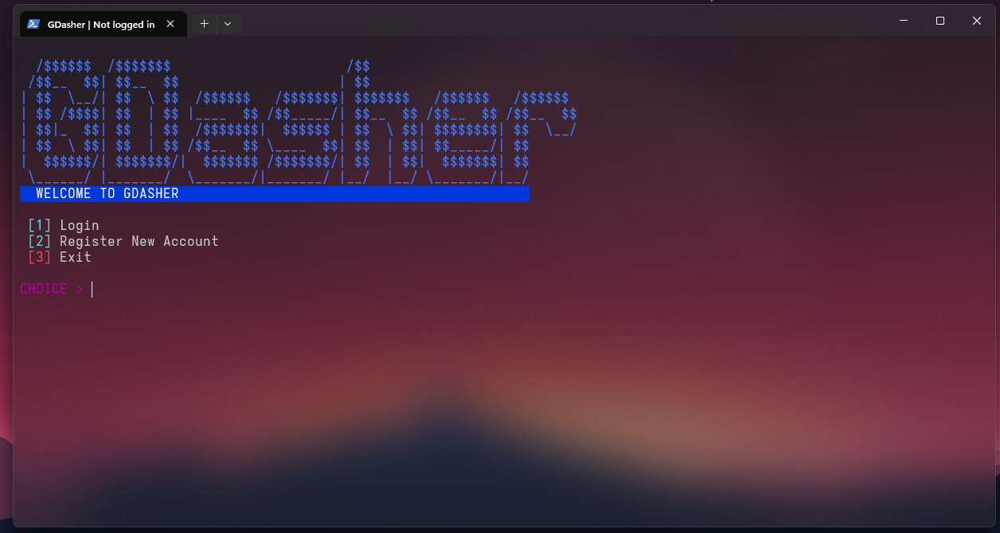
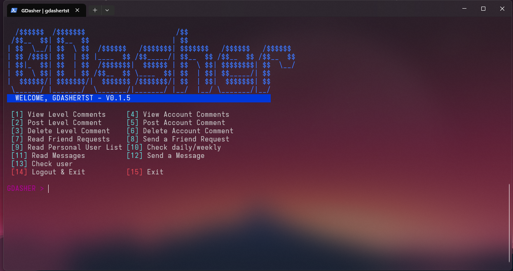
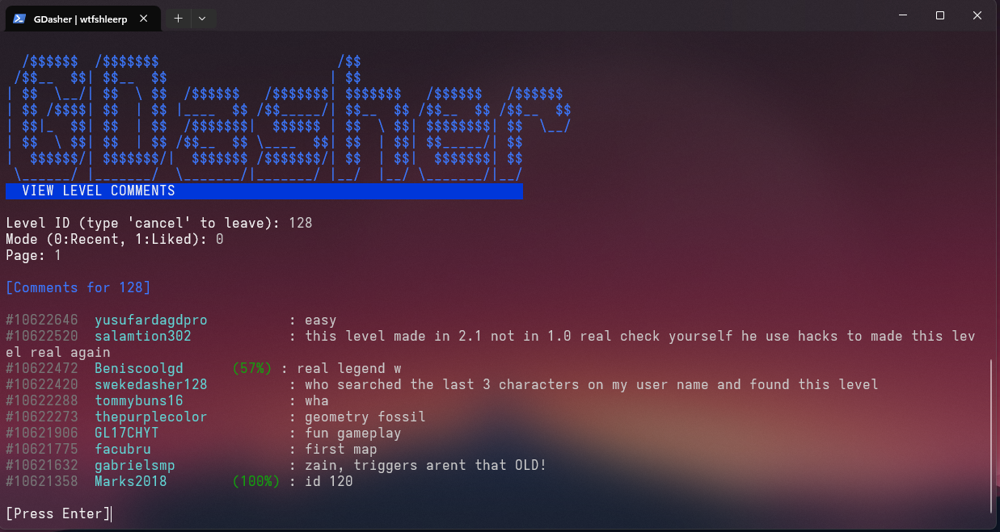
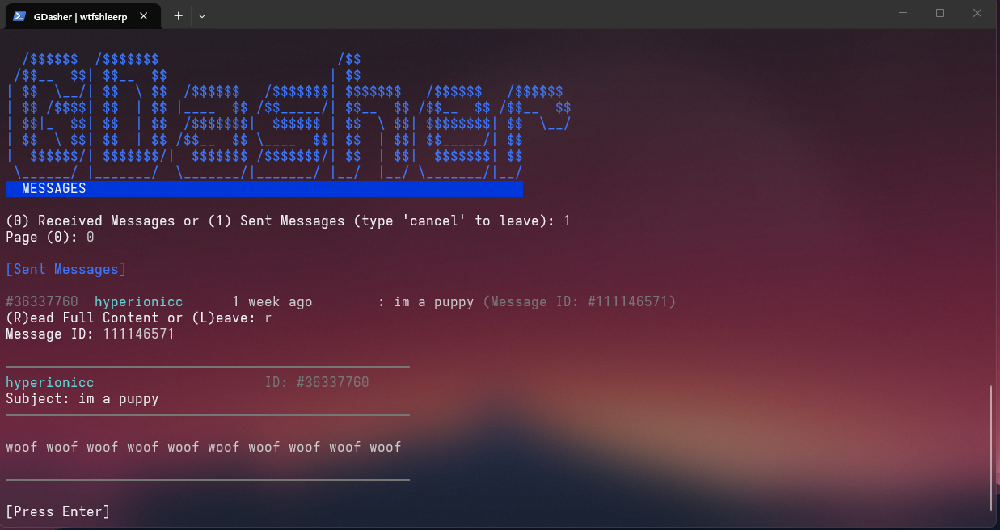
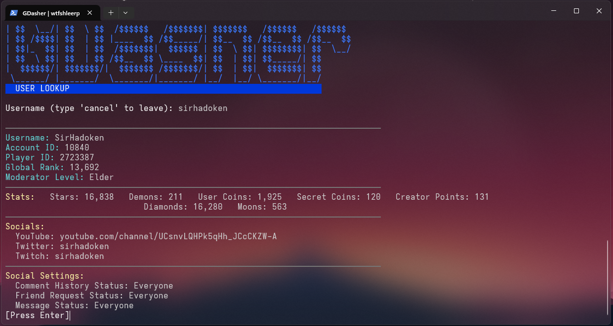
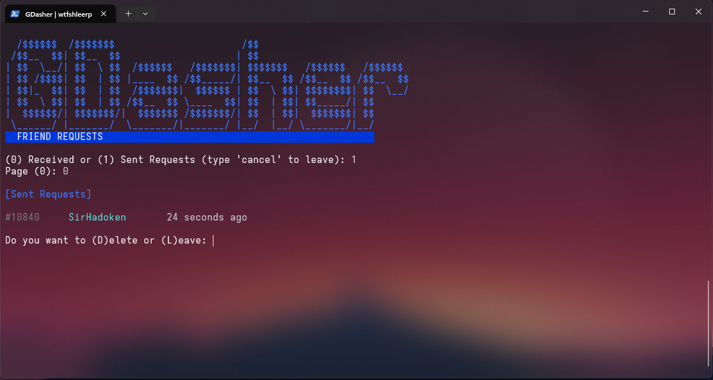

# GDasher

<div align="center">

[](https://github.com/giantpreston/gdasher/releases/latest)


**A powerful terminal-based client for Geometry Dash social features**



</div>

---

## ✨ Features at a Glance

| Category | Features |
|----------|----------|
| **💬 Level Comments** | View, post, delete comments with percentage tracking |
| **📝 Account Status** | Profile comments (like Twitter style) |
| **👥 Friends System** | Send/accept/reject requests, block users |
| **✉️ Private Messages** | Send/receive/read DMs with read status |
| **🔍 User Lookup** | View stats, socials, global rank, moderator status |
| **📅 Daily/Weekly** | Check current featured levels & time remaining |
| **🔐 Auth** | Register accounts & persistent login sessions |

---

## 🚀 Quick Start

**Download the latest release:**

[github.com/giantpreston/gdasher/releases/latest](https://github.com/giantpreston/gdasher/releases/latest)

**Or clone and run:**

```bash
git clone https://github.com/giantpreston/gdasher.git
cd gdasher
node index.js
```

**Zero dependencies.** Pure Node.js. No npm install needed. Just download and run.

<div align="center">

</div>

---

## 🎮 What Can You Do?

### Level Comments
- See what people are saying about any level
- Send comments to any level and append a percentage
- Delete your own comments

### Account Status
- Update your account comments
- Check any user's account comments
- Delete your own account comments

### Friend System
- Send friend requests with custom messages
- See who requested you (with "NEW!" indicators)
- Accept/reject anyone from the list
- Block annoying users

### Private Messaging
- Full DM system with subjects
- Read receipts (NEW! badge for unread)
- View sent messages archive

### User Intelligence
- Look up anyone by username
- See exact stats (stars, demons, coins, diamonds, moons)
- Check if they're a mod or elder mod
- View their linked socials (YouTube, Twitter, Twitch, Discord, Instagram)
- See their privacy settings

---

## 📋 Command Reference

| Command | Action |
|---------|--------|
| `1` | View Level Comments |
| `2` | Post Level Comment |
| `3` | Delete Level Comment |
| `4` | View Account Comments |
| `5` | Post Account Comment |
| `6` | Delete Account Comment |
| `7` | Read Friend Requests |
| `8` | Send Friend Request |
| `9` | Manage Friends/Blocked |
| `10` | Check Daily/Weekly |
| `11` | Read Messages |
| `12` | Send Message |
| `13` | Lookup User |
| `14` | Logout & Exit |
| `15` | Exit |

---

## 🖼️ In Action

<div align="center">

| Level Comments | Messages |
|----------------|----------|
|  |  |

| User Lookup | Friend Requests |
|--------------|-----------------|
|  |  |

</div>

---

## 🛠️ How It Works

GDasher directly interfaces directly with Geometry Dash's internal API endpoints, without any other servers in the middle:

```
┌─────────────┐     HTTP POST     ┌──────────────────┐
│  GDasher    │ ────────────────▶ │  Geometry Dash  │
│  (Terminal) │ ◀──────────────── │  API Servers    │
└─────────────┘     Plaintext     └──────────────────┘
```

**Security:** 
- Passwords are hashed using GJP2 (same as official client)
- No plaintext password storage
- Session saved locally in `auth.dat` **(Do NOT share this file to others!)**

**Smart Parsing:**
- Automatically handles Geometry Dash's weird pipe-delimited (`|`) and colon-delimited (`:`) responses
- Color-coded terminal output for readability

---

## 📦 Project Structure

```
gdasher/
├── index.js          # Main app. All UI and flow logic
├── auth.js           # Login, GJP2 generation, session persistence
├── network.js        # HTTP requests to Geometry Dash endpoints
├── utils.js          # Response parsers, base64, CHK generation
├── auth.dat          # Your saved session (auto-generated) (DON'T SHARE THIS!)
└── screenshots/      # Documentation images
```

---

## 🧪 API Endpoints Used

<details>
<summary>Click to see all 22 endpoints</summary>

| Endpoint | Function |
|----------|----------|
| `accounts/registerGJAccount.php` | Create account |
| `accounts/loginGJAccount.php` | Authenticate |
| `getGJComments21.php` | Fetch level comments |
| `uploadGJComment21.php` | Post level comment |
| `deleteGJComment20.php` | Delete level comment |
| `getGJAccountComments20.php` | Fetch profile comments |
| `uploadGJAccComment20.php` | Post profile comment |
| `deleteGJAccComment20.php` | Delete profile comment |
| `getGJFriendRequests20.php` | Get friend requests |
| `uploadFriendRequest20.php` | Send request |
| `acceptGJFriendRequest20.php` | Accept request |
| `deleteGJFriendRequests20.php` | Reject request |
| `getGJUserList20.php` | Friends/blocked list |
| `removeGJFriend20.php` | Unfriend |
| `unblockGJUser20.php` | Unblock |
| `getGJMessages20.php` | Message list |
| `downloadGJMessage20.php` | Read message |
| `uploadGJMessage20.php` | Send message |
| `getGJUsers20.php` | Search user |
| `getGJUserInfo20.php` | User details |
| `getGJDailyLevel.php` | Daily/weekly |
| `getGJLevels21.php` | Level details |

</details>

---

## ❓ FAQ

**Will I get banned?**  
No, this uses the same public API as the official GD client.

**Why no song download or level search?**  
These are still being worked on! Level search, song and level downloading will come soon.

**Do I need to install anything?**  
Nope! Just Node.js.

**Is this malware?**  
No, you can read and decompile the releases yourself, I can guarantee it is virus-free!
---

## 📥 Download

Latest releases available at:  
**[github.com/giantpreston/gdasher/releases](https://github.com/giantpreston/gdasher/releases)**

---

## ⚠️ Disclaimer

This project is **not affiliated with RobTop Games**. Geometry Dash is a trademark of RobTop Games. This tool is for educational purposes use responsibly.

---

## 📄 License

Licensed under [MIT License](LICENSE).

---

<div align="center">

**Made with ❤️ by [giantpreston](https://github.com/giantpreston)**

[Report Bug](https://github.com/giantpreston/gdasher/issues) · [Request Feature](https://github.com/giantpreston/gdasher/issues)

</div>
